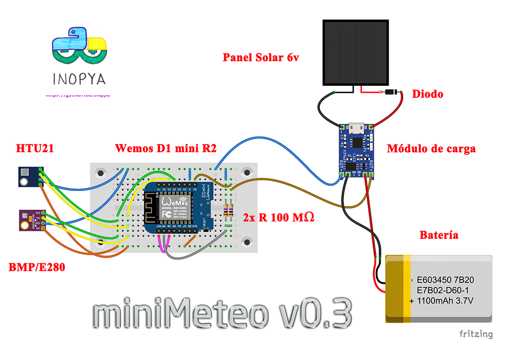
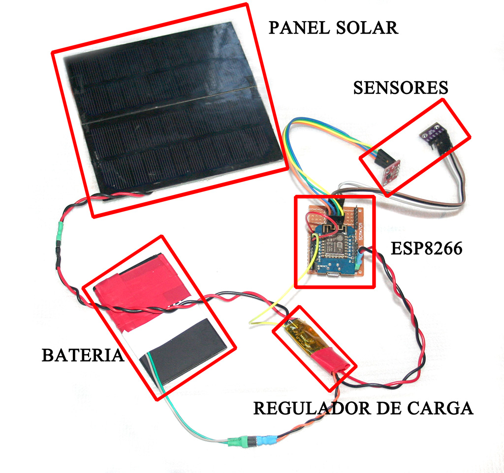
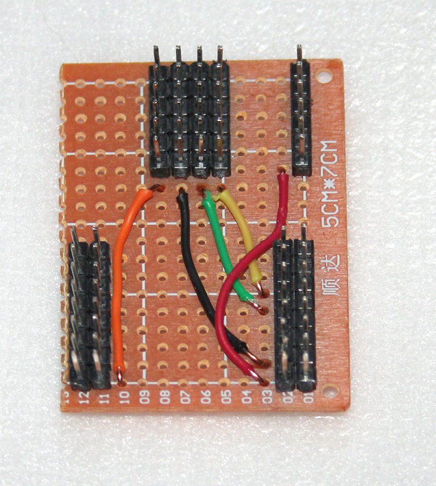
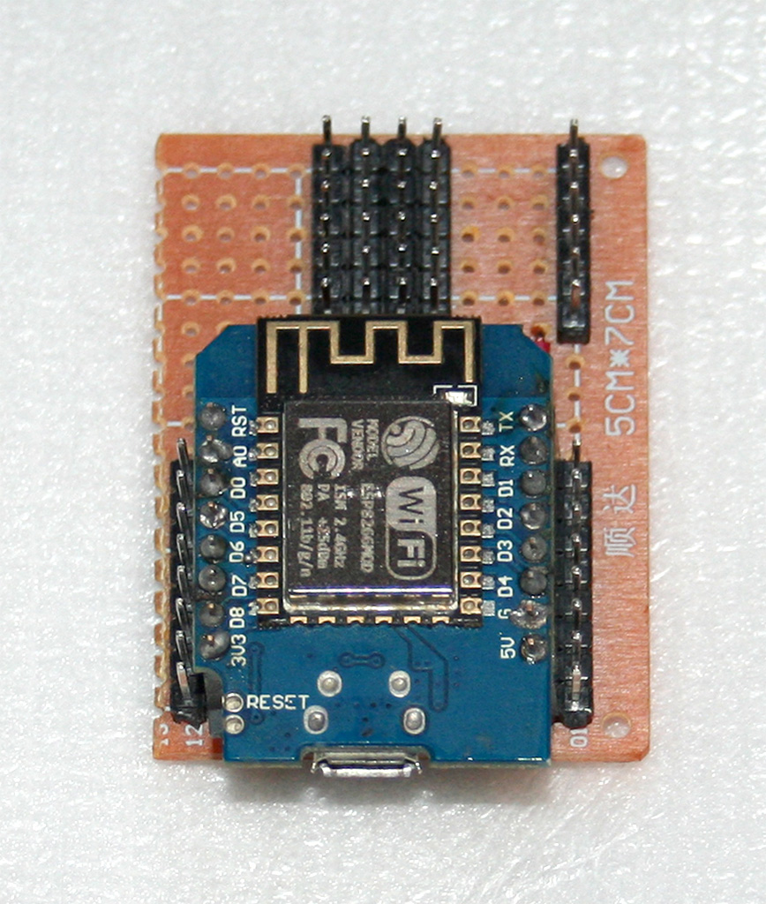
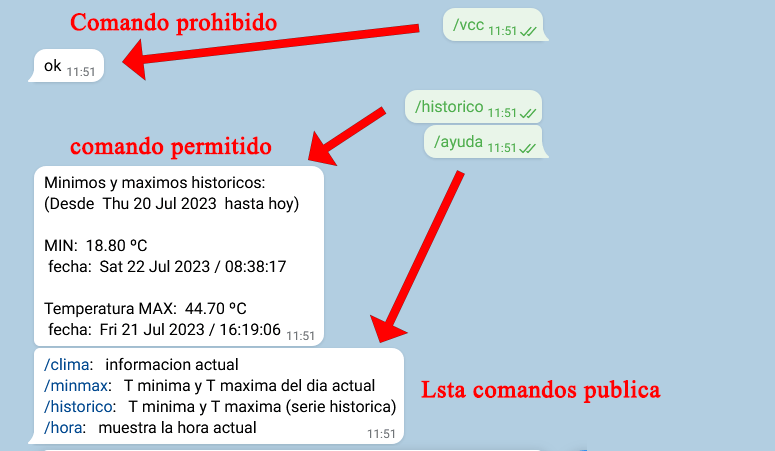
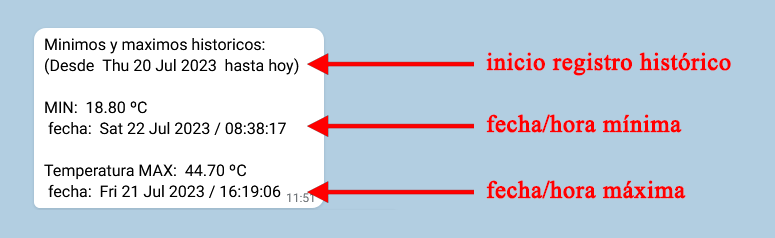
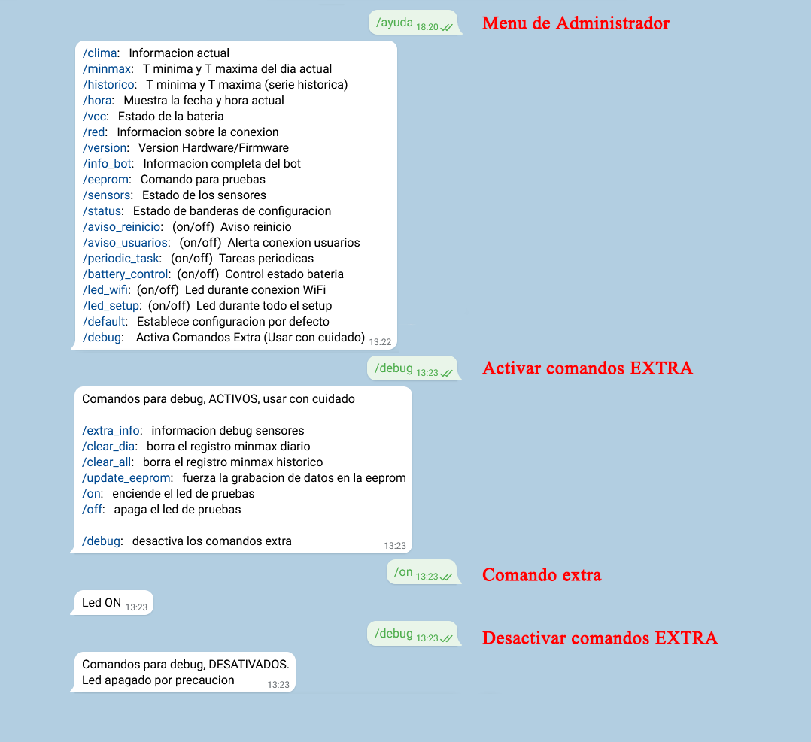

# minimeteo

Mini estacion meteorologica con esp8266 y cliente telegram.

¿Es minimeteo una estacion ***radicalmente diferente*** a las decenas de estaciones meteorológicas que puedes encontrar en la red?
***Tajantemente NO.***

Pero ***sí es un buen ejercicio*** para aprender nociones básicas y no tan básicas de programacion en el ecosistema Arduino, con un amplio abanico de funciones simples pero utiles y codigo claro, ordenado y comentado.
Puedes usar a minimeteo para lo que se diseñó: ser una pequeña estacion meteorologica doméstica, o si te estás iniciando en el uso de placas de desarrollo  ESPxx, puedes usar este montaje para profuncdizar en el uso de **deepsleep para ahorrar bateria,** trabajar con **eeprom** para guardar datos y configuraciones de tus montajes ante eventuales cortes de suministro sin la necesidad de usar memorias externas ni tarjetas SD. Trabajar con zonas horarias y manejar los **cambios horarios invierno y verano** que se realizan en paises como españa. Adentrarte en el excitante y util mundo de los **bots de telegram** para tus montajes de IoT. Utilizar la libreria Wifimanager para establecer un **portal de configuracion** desde el que poder seleccionar la red wifi a la que conectas sin necesidad de modificar el firmware, o como dar un plus a tu montajes utilizando la sencillez y la potencia de las actualizaciones mediante **OTA.**

Espero que te sea útil y que disfrutes de su uso como yo lo he hecho durante su creacion.

Gracias a **@egosh** por jugar con minimeteo desde sus version inicial y convertirla en [pymeteo](https://github.com/egosh/PyMeteo)

Recuerda que deberas añadir las credenciaes de tu bot de telegram en el fichero ***config.h*** para poder utilizar a minimeteo.
No necesitas añadir al codigo los datos de tu red wifi. Cuando el sistema inicie por  primera vez, al no poder conectar a ninguna red, montará un punto de acceso con un portal de configuracion. Si tu navegador no entra directaemtne en dicho portal, su direccion **IP es 195.168.5.1**

Los datos por defecto de dicha red son SSID: "INOPYA_IoT-minimeteo" y la contraseña: "minimeteo", pero puedes modificarlos desde dicho fichero ***config.h*** .

Si por algun motivo no deseas implementar el medidor de nivel de bateria mediante el divisor de tension conectado a A0 (por ejemplo porque desees utilizar dicha entrada analogica para algun sensor u otro proposito) puedes seguir disponiendo de un control de nivel de  bateria (algo menos preciso, pero igualmente util) mediante la funcion **ESP.getVcc()**.
Para ello no debes modificar nada en el código. Simplemente indicarlo en el mencionado fichero de configuración.

Para la correcta medicion del nivel de la bateria dispones de dos parametros (segun el modo de medicion que uses) que son ***FACTOR_AJUSTE_ADC_INT y FACTOR_AJUSTE_A0.*** 
Deberas hacer algunas pruebas y de forma empirica determinar el factor de correccion para que las medidas de nivel de bateria se aproximen lo mas posible al valor real.

Recuerda que en el fichero de configuración tienes todos los parametros necesarios para el control de tu montaje: tiempos entre lecturas de los sensores, la duracion de los periodos de deepsleep, la frecuencoa de acceso al servidor de telegram, niveles de bateria usados como umbrales para "dormir y despertar" a minimeteo, etc... 
Por supuesto sientete libre de modificar, mejorar o añadir cualquier funcion que consideres necesaria.

## NOTAS DE LA VERSION  

Versión 0.1       Fecha: 14/05/2021
- control basico de sensoses
- envio informacion a telegram

Versión 0.2       Fecha: 16/05/2021
- Control del WDT para evitar los "tipicos" reinicios causados por el wifi en las placas de desarrollo basadas en ESP8266 que solo disponen de un nucleo para todas las tareas
- se establecen comandos para funciones exclusivas del administrador 
- registro de minimas y maximas diarias (sin horario)
- Posibilidad de mensajes Serial para Debug

Versión 0.3      Fecha: 08/07/2023 
Revisitando el proyecto...
- Control del momento horario en que se producen las minimas y maximas diarias.
- Control de minimas y maximas para una serie historica (el administrador puede restablecer el periodo)
- Conserva en eeprom los valores y momentos de minimas y maximas
- Funciones para ajuste del horario invierno/verano
- Descarta sensores no conectados en los mensajes de informacion.
- Avisa si todos los sensores fallan y no puede tomar datos de ningun tipo
- Habilitadas actualizaciones por OTA 
- Posibilidad de reenviar los mensajes de los clientes al administrador
- Monitorizacion del estado de la bateria
- Posibilidad de entrar en modo LightSleep (DeepSleep con control de Timer) si la bateria es baja 
- Separacion de los parametros mas utilizados en el fichero "config.h" para facilitar modificaciones y personalizacion

//TO-DO ??
- ampliar sensores: UV, pluviometro, anemometro... 
- configurar el tiempo de los envios periodicos mediante mensaje telegram
- configurar mediante mensajes telegram los niveles de bateria baja para sleep mode
- configurar mediante mensaje telegram los periodos sleep
- ...
	  

## Lista de materiales

- 1x Wemos D1 mini R2 u otra placa de desarrollo con ESp8266 (o ESP32)
- 1x celula solar 5v/6v y 1W o mas. (de su potencia dependerá la rapidez de carga de nuestra bateria de reserva)
- 1x diodo 1N5819 (o similar), para evitar el consumo por parte de la celula solar en las horas de oscuridad
- 2x resistencias 100 MΩ
- 1x bateria lipo 3.7v (teléfono móvil, 18650,...)
- 1x Modulo de carga para baterias Lipo tipo TP4056 (o similar)
- 1x Sensor barométrico BMP/E280 (o similar)
- 1x Sensor humedad HTU21D /HTU31D (o similar)
- 1x protoboard o placa perforada
- cables 
- pines, soldador, estaño (en esta version optamos por montaje en placa perforada) 

## Esquema de montaje

##  Imagen del montaje real

## Escudo sobre placa perforada
Para esta versión se ha obtado por un montaje "un poco mas definitivo" y se ha creado un escudo sobre placa perforada.

## Imagenes de la interfaz telegram

Algunas imagenes del aspecto de los menús de interacción desde el bot de telegram

Menu accesible por los usuarios públicos. 
Contiene solo un reducido conjunto de comandos:

Muestra de respuestas de minimeteo ante la petición de un comando prohibido para usuarios y la petición del registro histórico de temperaturas mínimas y máximas (comando público)

Menú de comandos del administrador. Set de comandos Básicos + set de comandos Extra

